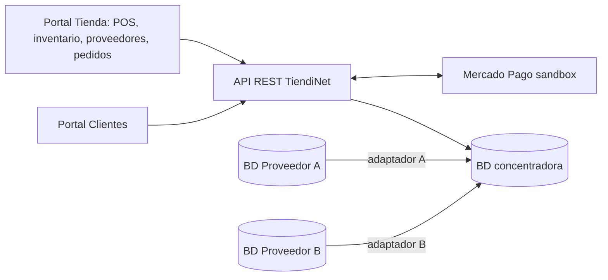

# Especificación de Requisitos de Software (SRS): TiendiNet — Versión de equipo

| Campo | Valor |
|---|---|
| Sistema | TiendiNet |
| Versión | 2.0 (consolidada de equipo) |
| Fecha | 02/10/2026 |
| Estándar | IEEE Std 830-1998 (estructura simplificada de S02-A1) |
| Equipo | José Alberto Ramírez Morales · Ángel Vega Martínez · Víctor Manuel Jurado Herrera · Adrián Alberto Cortés Alvarez |
| Fuentes | SRS individuales de los 4 integrantes, `proyecto_base.md`, entrevistas con el cliente (P1–P7) y decisiones de equipo registradas en `diferencias_SRS.md` |

| Versión | Fecha | Cambio |
|---|---|---|
| 1.x | 27/09/2026 | SRS individuales (S02-A1). |
| 2.0 | 02/10/2026 | Consolidación de equipo. Los IDs se renumeran; la equivalencia con los IDs individuales está en `diferencias_SRS.md`. |

---

## 1. Introducción

### 1.1 Propósito del documento

Este documento especifica los requerimientos del MVP de TiendiNet y es el **contrato compartido del equipo**: la fuente de verdad para el diseño de la API (`openapi.yaml`), el backend, los dos portales, las pruebas automatizadas y la documentación final.

Los identificadores `RF-XX-AC-Y` son la clave de trazabilidad: cada endpoint del contrato OpenAPI referencia uno o más de ellos, y cada prueba automatizada lleva el ID del criterio que verifica en su nombre (por ejemplo, `test_RF_16_AC_5`).

Está dirigido al equipo de desarrollo, al Product Owner y al dueño de la tienda, quien valida que los requisitos reflejen su operación.

### 1.2 Alcance del sistema

TiendiNet es una aplicación web con dos portales (Portal Tienda y Portal Clientes) sobre una API REST. Su objetivo es que una tienda de abarrotes de barrio compita en su región con herramientas digitales. El MVP de 12 semanas cubre:

- **Una tienda.**
- **Punto de venta (POS)** que descuenta el inventario en tiempo real, emite comprobante, permite cancelar ventas, capturar ventas hechas sin internet y hacer el corte de caja diario.
- **Inventario por lotes** con caducidad, ajustes auditables, punto de reorden (manual al inicio y calculado cuando hay historial) y alertas.
- **Dos proveedores simulados** con bases de datos de estructura distinta, unificados en una **base de datos concentradora**; captura manual de ofertas de proveedores sin base de datos; comparación normalizada, sugerencia de proveedor y propuesta de orden de compra.
- **Portal de clientes**: catálogo, carrito, pago anticipado en línea, recoger en tienda o envío a domicilio, seguimiento, cancelación y manejo de faltantes.
- **Reportes**: reporte diario, rotación e indicadores.

| Alcance | Contenido |
|---|---|
| **Incluido** | Todo lo anterior (RF-01 a RF-29). |
| **Incluido con simplificación** | Pago en línea con Mercado Pago en modo *sandbox* detrás de una interfaz propia, más un adaptador simulado para pruebas (RF-23). Las ventas sin conexión se capturan después (RF-19), no se registran offline. La propuesta de orden de compra no se envía al proveedor (RF-14). |
| **Fase 2 (fuera del MVP)** | Operación del POS sin conexión con sincronización automática (RF-30). Pasarela de pago productiva. Saldo a favor del cliente. |
| **Fuera de alcance** | Más de una tienda; apps móviles nativas; facturación electrónica (CFDI); productos a granel o por peso; integración de la terminal bancaria con el POS; pago en efectivo al recoger; APIs reales de proveedores; importación de listas en Excel/CSV; envío automático de órdenes de compra; promociones, crédito y lealtad; notificaciones por WhatsApp/SMS; contabilidad y nómina; despliegue productivo en la nube. |

### 1.3 Definiciones y acrónimos

| Término | Definición |
|---|---|
| **POS** | Punto de venta del mostrador. |
| **Portal Tienda / Portal Clientes** | Interfaz del Dueño y Empleados / interfaz del cliente. |
| **BD concentradora** | Base central de TiendiNet: productos, ofertas, inventario, ventas y pedidos. |
| **BD de proveedor** | Base independiente que simula el sistema de un proveedor (A y B, con esquemas distintos). Solo lectura. |
| **Proveedor de ruta** | Proveedor sin BD en el sistema (pan, refresco). Se registra como "Otro (ruta)" o con ofertas manuales (RF-11). |
| **Ficha de producto** | Registro único de un producto de la tienda; se usa igual en el POS y en el catálogo en línea. |
| **Oferta** | Datos de un proveedor para un producto: presentación, factor de conversión, costo, existencia del proveedor, días de entrega y fecha de actualización. Origen: "Sincronizada" o "Manual". |
| **Oferta vigente** | Oferta actualizada hace 7 días o menos y con existencia del proveedor mayor que 0. |
| **Unidad base / factor de conversión** | Unidad mínima de venta del producto (pieza) / número de unidades base que trae una presentación del proveedor (caja de 12 → 12). |
| **Costo por unidad base** | Costo de la presentación ÷ factor de conversión. Es el valor con el que se comparan proveedores. |
| **Proveedor preferido** | Proveedor que el Dueño asigna a un producto. Si no asigna ninguno, es el de la oferta vigente de menor costo por unidad base. |
| **Lote** | Unidades de un producto recibidas en una misma entrada, con la misma fecha de caducidad. |
| **Lote caducado** | Lote cuya fecha de caducidad es anterior a la fecha actual. Un lote que caduca hoy se puede vender hoy. |
| **Existencia física** | Unidades presentes en la tienda. |
| **Apartado (reserva)** | Unidades comprometidas por pedidos en línea aún no entregados. En pantalla se dice "apartado". |
| **Existencia disponible** | Existencia física − apartado − unidades de lotes caducados. Es lo único que se puede vender o pedir. |
| **Venta completada / cancelada** | Venta confirmada que descontó inventario / venta conservada en el historial cuyas unidades se reintegraron. |
| **Venta diferida** | Venta hecha sin conexión y capturada después con su fecha y hora reales. |
| **Descuadre** | Marca de un producto cuando una venta diferida excede la existencia disponible; exige conteo físico. |
| **Corte de caja** | Cierre que compara el efectivo esperado contra el efectivo contado. |
| **CDP** | Consumo diario promedio = unidades vendidas (mostrador + en línea, sin canceladas ni merma) en los últimos *d* días ÷ *d*, con *d* = min(28, días de historial). Se calcula solo con al menos 14 días de historial. |
| **Punto de reorden (PR)** | Nivel de existencia disponible en el que un producto debe resurtirse. Ver RF-08. |
| **PR inicial** | PR que captura el Dueño; se usa mientras no hay historial suficiente para calcularlo. |
| **PR calculado** | ⌈CDP × (días de entrega + días de seguridad)⌉. |
| **Días de seguridad** | Margen configurable (0 a 14; por defecto 2). |
| **Días de entrega de respaldo** | Días de entrega configurados por producto; se usan cuando no hay oferta vigente del proveedor preferido. |
| **Cantidad sugerida** | ⌈CDP × 7⌉ si hay CDP; si no, PR − disponible + 1 (lo que falta para quedar por encima del PR). |
| **FEFO** | *First Expired, First Out*: las salidas se descuentan primero de los lotes no caducados que caducan antes. |
| **Perecedero / Restringido** | Producto con caducidad obligatoria / producto que no se vende en línea (alcohol y tabaco). |
| **Folio** | Identificador único e incremental de una venta o de un pedido. |
| **MP / Sandbox / Webhook** | Mercado Pago / modo de pruebas sin cobros reales / notificación HTTP de MP al backend. |
| **Conciliación** | Consulta periódica a la API de MP para detectar pagos o reembolsos cuyo webhook no llegó. |
| **MoSCoW** | Prioridad: Must (indispensable), Should (importante), Could (deseable). |
| **RF / RNF / RD / AC** | Requerimiento funcional / no funcional / de dominio / criterio de aceptación. |
| **`RF-XX-AC-Y`** | Identificador único del criterio Y del requerimiento XX. |
| **S-XX** | Supuesto adoptado para hacer verificable un criterio (sección 3.6). |
| **JWT / p95 / SKU / LFPDPPP** | JSON Web Token / percentil 95 / código del producto / Ley Federal de Protección de Datos Personales en Posesión de los Particulares. |

### 1.4 Referencias

- IEEE. (1998). *IEEE Std 830-1998: Recommended practice for software requirements specifications*.
- IEEE Computer Society. (2024). *SWEBOK v4.0a, Chapter 1: Software Requirements*.
- North, D. (2006). *Introducing BDD*. Better Software.
- Wiegers, K. y Beatty, J. (2013). *Software requirements* (3.ª ed.). Microsoft Press.
- `proyecto_base.md`, `transcript_entrevista.md`, SRS individuales y `diferencias_SRS.md`.
- Documentación de Mercado Pago Checkout Pro y webhooks (modo *sandbox*).
- LFPDPPP (México).

### 1.5 Visión general del documento

La sección 2 describe el producto, los usuarios, las restricciones y la arquitectura propuesta. La sección 3 detalla los requerimientos funcionales con prioridad y criterios Dado que / cuando / entonces, los no funcionales con su verificación, los de dominio, la matriz de permisos, los datos mínimos, los supuestos y la trazabilidad. La sección 4 propone el orden de entrega.

---

## 2. Descripción general

### 2.1 Perspectiva del producto

TiendiNet es un producto nuevo que sustituye la caja registradora que solo suma, la libreta de inventario, los precios de proveedores que llegan por WhatsApp y los encargos por mensaje.

**Arquitectura y tecnología (propuesta de equipo).** Si cambia, solo se actualiza esta tabla; los requisitos no cambian.

| Capa | Tecnología |
|---|---|
| Portales Tienda y Clientes | React + Vite + TypeScript, diseño responsivo, componentes compartidos |
| Backend | Python + FastAPI + SQLAlchemy + Alembic; especificación OpenAPI generada |
| BD concentradora | PostgreSQL (transacciones ACID y bloqueo por fila) |
| BD Proveedor A / B | PostgreSQL / SQLite o MySQL, con esquemas distintos; un adaptador por proveedor |
| Autenticación | Correo y contraseña con bcrypt; sesión con JWT |
| Pagos en línea | Interfaz propia `ServicioPagos` con dos implementaciones: Mercado Pago *sandbox* y simulada (para pruebas automatizadas) |
| Correo | SMTP (Mailpit en local) |
| Ejecución | Docker Compose en un equipo del proyecto, expuesto por túnel HTTPS para portales y webhooks |

**Interfaces externas.**
- **Usuario:** navegador en PC con Windows (Portal Tienda) y en celular (ambos portales). El POS se opera por completo con teclado o pantalla táctil.
- **Hardware:** lector de código de barras USB que emula teclado (opcional).
- **Software:** API de Mercado Pago (pagos, webhooks, reembolsos, consulta), SMTP y BD de los proveedores A y B (solo lectura).
- **Comunicaciones:** HTTPS/JSON.

### 2.2 Funciones del producto

| Módulo | Funciones | Requisitos |
|---|---|---|
| Acceso | Autenticación, roles, cuentas de cliente, usuarios de la tienda | RF-01 a RF-03 |
| Catálogo e inventario | Productos, recepciones por lote, ajustes, caducidades, punto de reorden, alertas | RF-04 a RF-09 |
| Proveedores y compras | Unificación en la BD concentradora, ofertas manuales, comparación normalizada, sugerencia, propuesta de compra | RF-10 a RF-14 |
| Punto de venta | Búsqueda, venta, comprobante, cancelación, ventas diferidas, corte de caja | RF-15 a RF-20 |
| Tienda en línea | Catálogo, pedido, pago, estados, faltantes, seguimiento, reembolsos | RF-21 a RF-27 |
| Administración | Configuración de la tienda, reportes e indicadores | RF-28, RF-29 |

### 2.3 Características del usuario

| Actor | Descripción | Nivel técnico | Dispositivo |
|---|---|---|---|
| **Dueño** | Administra la tienda: precios, costos, proveedores, configuración, usuarios y reportes. Puede hacer todo lo del Empleado. Puede haber más de un Dueño (por ejemplo, la dueña y su hija como co-dueña). | Muy básico a medio | PC y Android |
| **Empleado** | Cobra en mostrador, hace corte de caja, registra recepciones y ajustes, y prepara y entrega pedidos. No ve costos ni ofertas. Cubre los perfiles de cajero y encargado de bodega. Es opcional. | Básico | PC del mostrador y Android |
| **Cliente** | Vecino que compra desde su celular; necesita cuenta para pedir. | Variable | Celular |
| **Sistema de proveedor** (externo) | BD simulada con catálogo, costo, existencia y días de entrega. | — | — |
| **Mercado Pago** (externo) | Procesa pagos y reembolsos. | — | — |
| **Reloj del sistema** | Dispara los procesos programados (sincronización, PR, alertas, expiraciones, conciliación). | — | — |

**Perfil observado.** La dueña real registra ventas en libreta, atiende sobre todo a vecinos y familia y se describe como poco afín a la tecnología; el sistema lo operará su hija con acceso completo. TiendiNet debe diseñarse para esa **brecha digital**: lenguaje cotidiano ("código" en vez de "SKU", "apartado" en vez de "reserva"), pocas pantallas y aprendizaje en minutos (RNF-11).

### 2.4 Restricciones

- **Plazo y equipo:** 12 semanas, 4 integrantes. Si falta tiempo se recorta según la prioridad MoSCoW (sección 4).
- **Alcance:** 1 tienda y 2 proveedores simulados con esquemas distintos.
- **Plataforma:** solo web responsiva; Chrome y Edge en Windows, Chrome en Android y Safari en iOS (RNF-08).
- **Venta:** solo por pieza o paquete, en cantidades enteras positivas (RD-02).
- **Pagos:** en mostrador, efectivo o tarjeta en la terminal externa (solo se registra el método). En línea, solo pago anticipado vía `ServicioPagos`. TiendiNet nunca almacena datos de tarjeta.
- **Conectividad:** el internet de la tienda es intermitente. El POS requiere conexión; la continuidad se cubre con las ventas diferidas (RF-19) y la conciliación de pagos (RF-23-AC-3).
- **Zona horaria:** las fechas y horas de negocio se interpretan en America/Mexico_City; los timestamps se guardan en UTC. "N días" son días calendario.
- **Diseño:** confirmar una venta, crear un pedido, cancelar y procesar un webhook se ejecutan en una sola transacción con bloqueo por fila sobre la existencia.
- **Acceso:** precios, costos, proveedores, usuarios, configuración y reportes son exclusivos del Dueño (RD-06).
- **Legales:** no se venden alcohol ni tabaco en línea (RD-01); los datos personales se tratan conforme a la LFPDPPP (RNF-10). No se emiten comprobantes fiscales.

### 2.5 Supuestos y dependencias

Los valores marcados con ⚑ no los pudo validar la clienta real (no tiene experiencia con venta en línea); se validarán con un prototipo navegable. Todos son configurables en RF-28, así que cambiarlos no requiere modificar código.

| Supuesto | Valor por defecto | Fuente |
|---|---|---|
| ⚑ Zona de entrega | Códigos postales a unos 2 km | Entrevista P4 |
| ⚑ Pedido mínimo para envío / costo de envío | $150.00 / $25.00 | Entrevista P4; decisión de equipo |
| ⚑ Horario de entrega y recolección | 9:00 a 20:00 | Entrevista P4 |
| ⚑ Hora límite para entrega el mismo día | 19:00 | Supuesto |
| ⚑ Retención de un pedido no recogido | Hasta el cierre (20:00) del día siguiente a "Listo para recoger" | Entrevista P5 |
| ⚑ Anticipación del aviso de caducidad | 3 días | Entrevista P1 |
| ⚑ Plazo de respuesta del cliente ante un faltante | 30 minutos | Supuesto |
| ⚑ Volumen | 200 ventas de mostrador y 30 pedidos en línea al día | Entrevista P6 |
| Apartado mientras se espera el pago | 15 minutos | Decisión técnica |
| Vigencia de una oferta | 7 días | Decisión técnica |

**Validado con la clienta real:** el POS sustituye la libreta de ventas; lo pagado en línea se aparta físicamente; un familiar opera con acceso completo; los proveedores mandan precios por WhatsApp; el éxito se mide en menos faltantes, caja cuadrada cada día y decidir una compra en unos 5 minutos.

**Dependencias:** disponibilidad del *sandbox* de Mercado Pago y del túnel HTTPS.

---

## 3. Requerimientos específicos

Se definen 30 requerimientos funcionales: 29 en el MVP y RF-30 en Fase 2. Los valores numéricos de los criterios son datos de prueba. Las respuestas HTTP indicadas son las que verifica la prueba de API; la interfaz muestra el mensaje entre comillas.

**Prioridad MoSCoW**

| Prioridad | Requerimientos |
|---|---|
| **Must** | RF-01, 02, 04, 05, 08, 09, 10, 12, 15, 16, 18, 21, 22, 23, 24, 26, 27, 28 |
| **Should** | RF-03, 06, 07, 11, 13, 17, 19, 20, 25, 29 |
| **Could** | RF-14 |
| **Fase 2** | RF-30 |

### 3.1 Requerimientos funcionales

#### Módulo de acceso

**RF-01: Autenticación y control de acceso por rol** · Must
El sistema debe autenticar con correo y contraseña a usuarios activos y habilitar solo las funciones de su rol: Dueño, Empleado o Cliente.

- **RF-01-AC-1**: **Dado que** existe un usuario activo con credenciales válidas, **cuando** inicia sesión, **entonces** el sistema responde 200 con un JWT que incluye su rol y la interfaz muestra solo las funciones autorizadas para ese rol.
- **RF-01-AC-2**: **Dado que** la contraseña es incorrecta o el usuario está inactivo, **cuando** intenta iniciar sesión, **entonces** el sistema responde 401 con "Correo o contraseña incorrectos", sin indicar cuál falló, y no crea sesión.
- **RF-01-AC-3**: **Dado que** un Empleado está autenticado, **cuando** solicita costos u ofertas de proveedor o intenta cambiar un precio de venta o un PR, incluso llamando directamente al endpoint, **entonces** el sistema responde 403 y los datos no cambian.
- **RF-01-AC-4**: **Dado que** un Cliente está autenticado, **cuando** llama a un endpoint del Portal Tienda (por ejemplo, registrar una venta), **entonces** el sistema responde 403.
- **RF-01-AC-5**: **Dado que** la combinación correo + IP acumula 5 intentos fallidos consecutivos, **cuando** intenta de nuevo dentro de 15 minutos, **entonces** el sistema responde 429. El contador se reinicia con un inicio de sesión exitoso.
- **RF-01-AC-6**: **Dado que** un visitante no ha iniciado sesión, **cuando** intenta abrir el Portal Tienda, confirmar un pedido o consultar un pedido, **entonces** el sistema lo dirige a iniciar sesión; el catálogo en línea sí puede consultarse sin sesión.

**RF-02: Registro y recuperación de cuenta de cliente** · Must
El visitante debe poder registrarse como Cliente con nombre, correo, teléfono de 10 dígitos, contraseña y dirección con código postal, y recuperar su contraseña por correo.

- **RF-02-AC-1**: **Dado que** un visitante captura datos válidos (contraseña de al menos 8 caracteres con letra y número) y acepta el aviso de privacidad, **cuando** envía el registro, **entonces** se crea una cuenta con rol Cliente y el sistema responde 201.
- **RF-02-AC-2**: **Dado que** el correo ya está registrado, **cuando** alguien intenta registrarse con él, **entonces** el sistema responde 409 con "Este correo ya está registrado" y no crea la cuenta.
- **RF-02-AC-3**: **Dado que** un cliente solicitó recuperar su contraseña, **cuando** usa el enlace dentro de los 30 minutos siguientes, **entonces** puede definir una nueva contraseña; un segundo uso o un uso posterior a los 30 minutos muestra "Enlace inválido o expirado".

**RF-03: Gestión de usuarios de la tienda** · Should
El Dueño debe poder crear cuentas con rol Dueño o Empleado y desactivarlas o reactivarlas. Siempre debe quedar al menos un Dueño activo.

- **RF-03-AC-1**: **Dado que** la Dueña captura nombre y correo de su hija con rol "Dueño", **cuando** guarda, **entonces** el sistema responde 201, la hija recibe un correo de activación y, al entrar, puede ver costos y cambiar precios.
- **RF-03-AC-2**: **Dado que** el Dueño desactiva a un Empleado que tiene un JWT vigente, **cuando** ese Empleado llama a cualquier endpoint, **entonces** el sistema responde 401.
- **RF-03-AC-3**: **Dado que** solo existe un Dueño activo, **cuando** intenta desactivarse a sí mismo, **entonces** el sistema responde 409 con "Debe existir al menos un Dueño activo".

#### Módulo de catálogo e inventario

**RF-04: Gestión del catálogo de productos** · Must
El Dueño debe poder crear, consultar, editar y desactivar productos con identificador interno, código de barras opcional (EAN-13), nombre, presentación, categoría, precio de venta, costo de referencia, PR inicial, banderas de perecedero y restringido, y estado. Cada producto tiene una sola ficha, usada en el POS y en el catálogo en línea.

- **RF-04-AC-1**: **Dado que** el Dueño captura un producto con código 7501055300075, nombre, presentación, categoría, precio de $38.50, costo de $31.00 y PR inicial de 10, **cuando** guarda, **entonces** el producto queda activo con existencia 0 y disponible para buscarse en el POS y, si no es restringido, para mostrarse en el catálogo en línea.
- **RF-04-AC-2**: **Dado que** ya existe un producto con el código 7501055300075, **cuando** el Dueño intenta crear otro con ese código, **entonces** el sistema responde 409 con "Código duplicado" y conserva el producto original.
- **RF-04-AC-3**: **Dado que** ya existe un producto con el mismo nombre y la misma presentación, **cuando** el Dueño intenta registrar otro igual, **entonces** el sistema responde 409 y conserva la ficha original sin cambios.
- **RF-04-AC-4**: **Dado que** falta un dato obligatorio, o el precio o el costo son negativos, **cuando** el Dueño intenta guardar, **entonces** el sistema responde 422, no crea la ficha e indica el campo inválido.
- **RF-04-AC-5**: **Dado que** un producto tiene ventas o movimientos asociados, **cuando** el Dueño lo desactiva, **entonces** deja de aparecer en el POS y en el catálogo en línea, y su historial sigue consultable.

**RF-05: Recepción de mercancía** · Must
El Dueño o un Empleado debe poder registrar mercancía recibida (producto, proveedor A, B, uno con ofertas manuales u "Otro (ruta)", cantidad entera positiva y, si es perecedero, fecha de caducidad), creando un lote. Solo el Dueño captura el costo unitario; si no lo captura, se toma el de la oferta vigente.

- **RF-05-AC-1**: **Dado que** "Aceite vegetal 1 L" tiene existencia física 3 y disponible 3, **cuando** un Empleado registra la recepción de 24 unidades del Proveedor A, **entonces** la existencia física y la disponible quedan en 27 antes de la siguiente operación, se crea un lote y se registra el movimiento con usuario, fecha y hora.
- **RF-05-AC-2**: **Dado que** el producto es perecedero, **cuando** se intenta registrar la recepción sin fecha de caducidad, **entonces** el sistema responde 422 con "La fecha de caducidad es obligatoria para productos perecederos" y no guarda la entrada.
- **RF-05-AC-3**: **Dado que** un Empleado envía una recepción que incluye costo unitario, **cuando** se procesa, **entonces** el sistema ignora el costo y el formulario del Empleado no muestra ese campo.
- **RF-05-AC-4**: **Dado que** llega el pan de un proveedor de ruta, **cuando** se registra la recepción con proveedor "Otro (ruta)", **entonces** se crea el lote sin oferta asociada.

**RF-06: Ajustes de inventario** · Should
El Dueño o un Empleado debe poder registrar mermas (indicando el lote) y conteos físicos, con motivo obligatorio y trazabilidad de la cantidad anterior y la nueva.

- **RF-06-AC-1**: **Dado que** un lote de "Yogurt natural 1 kg" con 6 unidades caducó, **cuando** un Empleado registra una merma de ese lote por 6 unidades con motivo "Caducado", **entonces** el lote queda en 0, se registran cantidad anterior, cantidad nueva, tipo, motivo, usuario, fecha y hora, y la merma no cuenta en el CDP.
- **RF-06-AC-2**: **Dado que** un producto tiene existencia física 20, **cuando** un Empleado registra un conteo físico de 18 con motivo, **entonces** la existencia queda en 18, se registra un ajuste de −2 descontado con FEFO y se quita la marca "Descuadre" si existía.
- **RF-06-AC-3**: **Dado que** un producto tiene existencia física 18, **cuando** se registra un conteo de 21, **entonces** se registra un ajuste de +3 que se suma al lote más reciente.
- **RF-06-AC-4**: **Dado que** falta el motivo o la merma es mayor que la cantidad del lote, **cuando** se intenta confirmar el ajuste, **entonces** el sistema responde 422 y la existencia no cambia.

**RF-07: Control de caducidades** · Should
El sistema debe registrar los lotes con su fecha de caducidad, mostrarlos por producto y, cada día a las 7:00, enviar al Dueño la lista de lotes que caducan en los próximos N días (por defecto 3) y de los ya caducados.

- **RF-07-AC-1**: **Dado que** un producto perecedero tiene un lote de 10 piezas con caducidad 05/10/2026 y otro de 8 con caducidad 12/10/2026, **cuando** un usuario consulta su inventario, **entonces** ve ambos lotes con cantidad y fecha.
- **RF-07-AC-2**: **Dado que** un lote de 6 "Yogurt natural 1 kg" caduca el 30/09/2026, **cuando** el proceso corre el 27/09/2026, **entonces** aparece en "Por caducar" con cantidad y fecha, y el Dueño recibe el resumen por correo.
- **RF-07-AC-3**: **Dado que** un lote con existencia caducó el 26/09/2026, **cuando** el proceso corre el 27/09/2026, **entonces** aparece en "Caducados" con la opción "Registrar como merma" (RF-06-AC-1), se muestra con estado "Caducado" y sus unidades ya no cuentan como disponibles.
- **RF-07-AC-4**: **Dado que** un lote caduca hoy, **cuando** se vende en el POS, **entonces** la venta se acepta.

**RF-08: Punto de reorden** · Must
Cada producto tiene un PR. El Dueño captura un PR inicial al darlo de alta. Cada día a las 6:00 el sistema lo recalcula con la fórmula de la sección 1.3 cuando el producto tiene al menos 14 días de historial; si no, conserva el PR inicial. El Dueño puede fijar un PR manual con fecha de vigencia que tiene prioridad sobre el calculado.

- **RF-08-AC-1**: **Dado que** el Dueño está en la configuración de un producto, **cuando** captura un PR entero mayor o igual a 0 y guarda, **entonces** el valor queda guardado.
- **RF-08-AC-2**: **Dado que** el Dueño captura un PR negativo, decimal o no numérico, **cuando** guarda, **entonces** el sistema responde 422 con "El punto de reorden debe ser un número entero mayor o igual a 0" y conserva el valor anterior.
- **RF-08-AC-3**: **Dado que** un producto vendió 112 unidades en los últimos 28 días, su proveedor preferido tiene una oferta vigente con 2 días de entrega y hay 2 días de seguridad, **cuando** se ejecuta el cálculo, **entonces** el PR queda en 16 (4 × (2 + 2)).
- **RF-08-AC-4**: **Dado que** un producto tiene menos de 14 días de historial, **cuando** se ejecuta el cálculo, **entonces** se conserva su PR inicial y se muestra "Historial insuficiente".
- **RF-08-AC-5**: **Dado que** el Dueño fija un PR manual de 30 con vigencia hasta el 03/11/2026, **cuando** el cálculo corre el 03/11/2026 o antes, **entonces** se conserva 30; desde el 04/11/2026 se usa el valor calculado.
- **RF-08-AC-6**: **Dado que** el proveedor preferido no tiene oferta vigente, **cuando** se ejecuta el cálculo, **entonces** se usan los días de entrega de respaldo; si tampoco hay, se conserva el PR vigente y se muestra "Sin proveedor con oferta vigente".
- **RF-08-AC-7**: **Dado que** el Dueño abre el detalle de un PR, **cuando** se muestra, **entonces** incluye el origen del valor (inicial, calculado o manual), el CDP, los días de historial, el origen de los días de entrega y los días de seguridad.

**RF-09: Alertas de reorden** · Must
El sistema debe generar una alerta cuando la existencia **disponible** de un producto sea menor o igual a su PR, por venta, apartado, merma o caducidad. La alerta indica la cantidad sugerida y, para el Dueño, el proveedor sugerido (RF-13). La ven el Dueño y los Empleados; los Empleados no ven costos.

- **RF-09-AC-1**: **Dado que** un producto tiene PR 5 y existencia disponible 6, **cuando** se confirma una venta de 1 pieza, **entonces** se genera una alerta visible en el panel con el nombre del producto, la disponible, el PR y la cantidad sugerida, y el Dueño recibe un correo.
- **RF-09-AC-2**: **Dado que** un producto tiene PR 5 y disponible 6, **cuando** un pedido pagado aparta 1 pieza, **entonces** también se genera la alerta.
- **RF-09-AC-3**: **Dado que** un producto tiene PR 5 y disponible 8, **cuando** se vende 1 pieza, **entonces** no se genera alerta y el producto no aparece en la lista de resurtido.
- **RF-09-AC-4**: **Dado que** ya existe una alerta activa del producto, **cuando** la disponible sigue bajando, **entonces** no se crea otra alerta y se actualiza la disponible mostrada.
- **RF-09-AC-5**: **Dado que** hay una alerta activa con PR 5 y disponible 4, **cuando** una recepción, cancelación o expiración deja la disponible en 10, **entonces** la alerta pasa a "Resuelta".

#### Módulo de proveedores y compras

**RF-10: Unificación de proveedores en la BD concentradora** · Must
El sistema debe leer de las BD de los Proveedores A y B (con estructura distinta) el código, nombre, presentación, factor de conversión, costo, existencia del proveedor y días de entrega, y registrarlos como ofertas en la BD concentradora con un adaptador por proveedor. Se ejecuta a diario a las 5:00 y bajo demanda del Dueño. Los datos del proveedor nunca modifican el precio de venta.

- **RF-10-AC-1**: **Dado que** el Proveedor A guarda sus productos con una estructura de columnas y el B con otra, **cuando** se sincronizan ambas, **entonces** cada oferta queda en la BD concentradora con los mismos campos comunes y su proveedor de origen, y el número de ofertas cargadas por proveedor coincide con el de su base.
- **RF-10-AC-2**: **Dado que** 3 registros del Proveedor B tienen costo vacío o negativo, factor de conversión menor o igual a 0 o días de entrega menores que 1, **cuando** se sincroniza, **entonces** esos 3 se rechazan, el resto se importa y el resumen lista código y motivo de cada rechazo.
- **RF-10-AC-3**: **Dado que** una oferta ya existe con costo $120.00, **cuando** una nueva sincronización la trae con $125.00, **entonces** la oferta queda en $125.00 con la fecha de actualización y el precio de venta del producto no cambia.
- **RF-10-AC-4**: **Dado que** un código del proveedor no está vinculado a ninguna ficha, **cuando** se sincroniza, **entonces** se agrega a "Productos por vincular" sin crear ficha; cuando el Dueño lo asocia a una ficha existente o confirma el alta de una nueva (con precio de venta y PR inicial), sale de la lista y su oferta se importa.
- **RF-10-AC-5**: **Dado que** la BD del Proveedor B no responde, **cuando** se ejecuta la sincronización, **entonces** el resumen registra "Error de conexión con Proveedor B", sus ofertas previas no se modifican y el Dueño ve el aviso en su panel.

**RF-11: Captura manual de ofertas** · Should
El Dueño debe poder registrar a mano la presentación, el costo, la existencia y los días de entrega que un proveedor sin BD le envía por WhatsApp u otro medio. La oferta tiene origen "Manual" y se usa igual que una sincronizada (RF-08, RF-12, RF-13).

- **RF-11-AC-1**: **Dado que** el proveedor "Abarrotes El Güero" mandó el precio del "Aceite vegetal 1 L" a $31.00 por pieza con entrega en 1 día, **cuando** el Dueño captura esa oferta, **entonces** aparece en la comparación con origen "Manual" y fecha de captura.
- **RF-11-AC-2**: **Dado que** una oferta manual se capturó hace 8 días, **cuando** se muestra en la comparación, **entonces** aparece como "No vigente", igual que una sincronizada.

**RF-12: Comparación normalizada de ofertas** · Must
El Dueño debe poder ver por producto todas sus ofertas con presentación, costo, **costo por unidad base**, existencia del proveedor, días de entrega, fecha de actualización y vigencia, ordenadas de menor a mayor costo por unidad base.

- **RF-12-AC-1**: **Dado que** el Proveedor A ofrece un producto en caja de 12 piezas a $120.00 con entrega en 3 días y el B en paquete de 6 a $66.00 con entrega en 1 día, **cuando** el Dueño abre la comparación, **entonces** ve $10.00 por pieza para A con la etiqueta "Menor costo" y $11.00 por pieza para B con la etiqueta "Entrega más rápida", en ese orden.
- **RF-12-AC-2**: **Dado que** una oferta tiene más de 7 días sin actualizar o existencia del proveedor 0, **cuando** se muestra, **entonces** aparece como "No vigente", al final y sin etiquetas.
- **RF-12-AC-3**: **Dado que** un producto solo tiene oferta de un proveedor, **cuando** el Dueño abre la comparación, **entonces** ve esa oferta con su costo por unidad base y el mensaje "Solo un proveedor ofrece este producto".

**RF-13: Sugerencia y elección de proveedor** · Should
Entre las ofertas vigentes con existencia del proveedor suficiente para la cantidad sugerida, el sistema debe sugerir la de menor costo por unidad base o, si el Dueño marca urgencia, la de menos días de entrega; un empate se resuelve con el otro criterio. El Dueño puede asignar un proveedor preferido por producto.

- **RF-13-AC-1**: **Dado que** A cuesta $10.00 por pieza con entrega en 3 días y B $11.00 con entrega en 1 día, **cuando** el Dueño pide una sugerencia sin marcar urgencia, **entonces** el sistema sugiere A.
- **RF-13-AC-2**: **Dado que** el mismo escenario, **cuando** el Dueño pide la sugerencia marcando urgencia, **entonces** el sistema sugiere B.
- **RF-13-AC-3**: **Dado que** A y B cuestan lo mismo por pieza y A entrega en 2 días y B en 4, **cuando** el Dueño pide una sugerencia sin urgencia, **entonces** el sistema sugiere A.
- **RF-13-AC-4**: **Dado que** el Dueño ve las ofertas, **cuando** asigna B como proveedor preferido, **entonces** la elección se guarda, el siguiente cálculo de PR usa los días de entrega de B y el precio de venta no cambia.
- **RF-13-AC-5**: **Dado que** ninguna oferta vigente tiene existencia suficiente, **cuando** se pide la sugerencia, **entonces** el sistema muestra "Sin proveedor con existencia".

**RF-14: Propuesta de orden de compra** · Could
El Dueño debe poder generar una propuesta de compra con los productos cuya disponible es menor o igual a su PR. La propuesta no se envía al proveedor ni modifica inventario.

- **RF-14-AC-1**: **Dado que** 3 productos tienen disponible menor o igual a su PR y 10 están por encima, **cuando** el Dueño genera la propuesta, **entonces** incluye exactamente esos 3, cada uno con su cantidad sugerida, el proveedor sugerido (RF-13) y su costo.
- **RF-14-AC-2**: **Dado que** existe una propuesta, **cuando** el Dueño cambia la cantidad o el proveedor de un renglón, o lo elimina, y guarda, **entonces** la propuesta conserva los cambios y el inventario no cambia.
- **RF-14-AC-3**: **Dado que** ningún producto está en o por debajo de su PR, **cuando** el Dueño intenta generar la propuesta, **entonces** el sistema muestra "No hay productos por reabastecer" y no la genera.

#### Módulo de punto de venta

**RF-15: Búsqueda de productos** · Must
El Dueño o un Empleado debe poder localizar productos activos por código de barras exacto (tecleado o con lector USB) o por coincidencia parcial del nombre, sin distinguir mayúsculas ni acentos.

- **RF-15-AC-1**: **Dado que** existe el producto activo "Frijol negro 1 kg", **cuando** se escribe "frij" en la búsqueda del POS, **entonces** el producto aparece con nombre, precio y existencia disponible.
- **RF-15-AC-2**: **Dado que** un producto activo tiene registrado un código de barras, **cuando** se captura o escanea ese código, **entonces** el sistema muestra exactamente ese producto con su precio y disponible.
- **RF-15-AC-3**: **Dado que** el código o el nombre no coinciden con ningún producto activo, **cuando** se busca, **entonces** el sistema muestra "Producto no encontrado" y la venta en curso no cambia.

**RF-16: Venta en mostrador** · Must
El Dueño o un Empleado debe poder armar una venta agregando, modificando o quitando renglones con cantidades enteras positivas, cobrarla en efectivo o con tarjeta en la terminal externa y confirmarla. La confirmación valida el pago, asigna un folio único, registra al usuario responsable y descuenta las existencias con FEFO en una sola transacción.

- **RF-16-AC-1**: **Dado que** "Aceite vegetal 1 L" ($38.50) tiene disponible 27, **cuando** el Empleado agrega 2 piezas, cobra en efectivo con $100.00 y confirma, **entonces** la venta queda "Completada" con folio único, total $77.00, cambio $23.00, el usuario, la fecha y la hora, y la existencia física queda en 25 antes de la siguiente operación.
- **RF-16-AC-2**: **Dado que** una venta en curso tiene 3 renglones con total de $90.00, uno de $20.00, **cuando** se quita ese renglón o se modifica una cantidad, **entonces** el total se recalcula ($70.00 al quitarlo) y la existencia no cambia hasta confirmar.
- **RF-16-AC-3**: **Dado que** una venta tiene total $52.50 en efectivo, **cuando** se captura un monto recibido de $50.00 y se intenta confirmar, **entonces** el sistema no confirma, muestra un faltante de $2.50 y no registra venta ni modifica existencias.
- **RF-16-AC-4**: **Dado que** una venta tiene total $52.50, **cuando** se selecciona "Tarjeta (terminal)" y se confirma, **entonces** la venta queda registrada con ese método por $52.50, sin pedir monto recibido ni calcular cambio.
- **RF-16-AC-5**: **Dado que** un producto tiene existencia física 5 y 5 piezas apartadas para pedidos en línea, **cuando** se intenta confirmar una venta que lo incluye, **entonces** el sistema responde 409, rechaza toda la venta, conserva todas las existencias y señala el producto, la cantidad solicitada y la disponible (0).
- **RF-16-AC-6**: **Dado que** queda 1 unidad disponible, **cuando** una prueba de integración ejecuta en paralelo dos confirmaciones de venta, o una venta y la creación de un pedido, por esa unidad, **entonces** exactamente una operación responde 2xx, la otra 409 con "Producto agotado", y ninguna existencia queda negativa.
- **RF-16-AC-7**: **Dado que** se captura una cantidad de 0, negativa o decimal, **cuando** se intenta agregar el renglón, **entonces** el sistema lo rechaza con "La cantidad debe ser un número entero mayor a 0".

**RF-17: Comprobante de venta** · Should
El sistema debe generar para cada venta confirmada un comprobante no fiscal consultable, con folio, fecha y hora, usuario, renglones, cantidades, precios, total, forma de pago, efectivo recibido y cambio.

- **RF-17-AC-1**: **Dado que** una venta fue confirmada, **cuando** se abre su comprobante, **entonces** se muestran folio, fecha y hora, usuario, renglones, cantidades, precios unitarios, total, forma de pago, efectivo recibido y cambio de esa venta.
- **RF-17-AC-2**: **Dado que** el precio de un producto cambió después de una venta, **cuando** un usuario de la tienda consulta el comprobante por su folio, **entonces** ve los precios almacenados al momento de la venta, sin recalcular.
- **RF-17-AC-3**: **Dado que** la venta fue cancelada, **cuando** se abre su comprobante, **entonces** se muestra con la marca "Cancelada", el motivo, el usuario y la fecha de cancelación.

**RF-18: Cancelación de venta** · Must
El Dueño o un Empleado debe poder cancelar una venta completada que aún no forma parte de un corte de caja cerrado, con motivo obligatorio. La cancelación conserva la venta, cambia su estado y reintegra las unidades a los lotes de los que salieron, exactamente una vez.

- **RF-18-AC-1**: **Dado que** el Empleado "E1" registró una venta hoy y no hay corte cerrado que la incluya, **cuando** el Empleado "E2" o el Dueño la cancela con motivo, **entonces** la venta queda "Cancelada", las unidades regresan a sus lotes, se conserva a "E1" como responsable de la venta y se registra quién canceló, el motivo, la fecha y la hora.
- **RF-18-AC-2**: **Dado que** una venta ya está cancelada, **cuando** se intenta cancelarla de nuevo, **entonces** el sistema responde 409 y no vuelve a incrementar existencias.
- **RF-18-AC-3**: **Dado que** una venta forma parte de un corte de caja cerrado, **cuando** se intenta cancelarla, **entonces** el sistema responde 409 con "La venta pertenece a un corte cerrado".
- **RF-18-AC-4**: **Dado que** una venta tiene registrado su responsable, **cuando** un usuario intenta modificar el usuario, la fecha o la hora, **entonces** el sistema no lo permite.

**RF-19: Captura de ventas diferidas** · Should
El Dueño o un Empleado debe poder capturar después una venta hecha sin conexión, indicando su fecha y hora reales (máximo 3 días atrás).

- **RF-19-AC-1**: **Dado que** el 27/09/2026 a las 18:10 no hubo internet y se vendieron 3 "Leche entera 1 L", **cuando** a las 19:00 el Empleado captura la venta diferida con la hora 18:10, **entonces** la existencia se descuenta, la venta queda marcada como "Diferida" y cuenta para el CDP y el reporte del 27/09/2026.
- **RF-19-AC-2**: **Dado que** una venta diferida de 4 unidades excede la disponible (2), **cuando** se captura, **entonces** la venta se registra completa, se descuentan solo las 2 disponibles sin tocar el apartado, el producto queda marcado "Descuadre" y el Dueño recibe un aviso para hacer un conteo (RF-06-AC-2).
- **RF-19-AC-3**: **Dado que** la fecha capturada es de hace más de 3 días o es futura, **cuando** se envía, **entonces** el sistema responde 422 con "Solo se pueden capturar ventas de los últimos 3 días".

**RF-20: Corte de caja** · Should
El Dueño o un Empleado debe poder hacer el corte de caja del día: el sistema muestra el efectivo esperado (ventas completadas en efectivo, sin canceladas), el efectivo contado, la diferencia y, por separado, las ventas con tarjeta. Las ventas en línea no forman parte del corte.

- **RF-20-AC-1**: **Dado que** en el día se confirmaron ventas por $1,000.00 en efectivo y $500.00 con tarjeta, **cuando** el Empleado hace el corte y captura $980.00 contados, **entonces** el sistema muestra efectivo esperado $1,000.00, contado $980.00, diferencia −$20.00 y tarjeta $500.00 por separado.
- **RF-20-AC-2**: **Dado que** en el día hubo una venta en efectivo de $100.00 que se canceló, **cuando** se hace el corte, **entonces** esa venta no suma al efectivo esperado.
- **RF-20-AC-3**: **Dado que** el usuario confirma el corte, **cuando** el sistema lo guarda, **entonces** queda registrado con usuario, fecha, hora, montos esperados, montos contados y diferencia, y sus ventas ya no pueden cancelarse (RF-18-AC-3).

#### Módulo de tienda en línea

**RF-21: Catálogo en línea** · Must
Cualquier visitante debe poder buscar productos por nombre y filtrar por categoría, viendo nombre, presentación, precio, disponibilidad ("Disponible" o "Agotado") y la etiqueta "Perecedero". No se muestran productos restringidos ni inactivos, ni costos, existencia exacta o datos de proveedores.

- **RF-21-AC-1**: **Dado que** hay productos activos cuyo nombre contiene "leche", **cuando** se busca "leche", **entonces** se listan solo esos, con presentación, precio y la etiqueta "Perecedero" si aplica, sin costo, existencia exacta ni proveedor.
- **RF-21-AC-2**: **Dado que** "Cerveza clara 355 ml" es restringida, **cuando** se busca "cerveza", **entonces** no aparece.
- **RF-21-AC-3**: **Dado que** un producto tiene disponible 0, **cuando** aparece en el catálogo, **entonces** se muestra "Agotado" y no se puede agregar al carrito.

**RF-22: Creación de pedido anticipado** · Must
El Cliente debe poder crear un pedido desde su carrito eligiendo "Recoger en tienda" o "Envío a domicilio". Al crearlo, el sistema aparta las cantidades durante 15 minutos en espera del pago y asigna la fecha de entrega o recolección según RD-04.

- **RF-22-AC-1**: **Dado que** el carrito tiene disponible suficiente y el cliente elige "Recoger en tienda", **cuando** confirma, **entonces** el pedido se crea con folio único en "Pendiente de pago", se apartan las cantidades, el envío es $0.00 y no se pide dirección.
- **RF-22-AC-2**: **Dado que** el cliente elige envío con subtotal de $150.00 o más y un código postal atendido, **cuando** confirma, **entonces** el total incluye el costo de envío configurado ($25.00).
- **RF-22-AC-3**: **Dado que** el cliente elige envío con subtotal de $120.00, **cuando** intenta confirmar, **entonces** el sistema responde 422 con "El pedido mínimo para envío es de $150".
- **RF-22-AC-4**: **Dado que** el cliente elige envío con un código postal no atendido, **cuando** intenta confirmar, **entonces** el sistema responde 422 con "No entregamos en tu código postal; puedes recoger en tienda".
- **RF-22-AC-5**: **Dado que** un producto tiene disponible 3, **cuando** el cliente intenta agregar 4 al carrito, **entonces** el sistema no agrega la cantidad y muestra "Solo hay 3 disponibles".
- **RF-22-AC-6**: **Dado que** el carrito está vacío, o no se eligió modalidad, o se eligió envío sin dirección, **cuando** el cliente intenta confirmar, **entonces** el sistema no permite continuar e indica lo que falta.
- **RF-22-AC-7**: **Dado que** un pedido con envío se paga a las 19:30, **cuando** se confirma el pago, **entonces** el pedido muestra "Entrega: mañana de 9:00 a 20:00" y aparece en "Por preparar" del día siguiente; lo mismo aplica a la recolección.
- **RF-22-AC-8**: **Dado que** un pedido lleva 15 minutos en "Pendiente de pago", **cuando** se cumple el plazo, **entonces** pasa a "Expirado" y se libera su apartado.
- **RF-22-AC-9**: **Dado que** el pedido incluye un producto restringido (por ejemplo, llamando directamente a la API), **cuando** se envía, **entonces** el sistema responde 422 con "Producto no disponible en línea" y no crea el pedido.

**RF-23: Pago anticipado en línea** · Must
El sistema debe cobrar el pedido mediante `ServicioPagos` (Mercado Pago *sandbox*) y marcarlo como pagado solo al confirmar un pago auténtico por webhook o por conciliación. No ofrece pago en efectivo al recoger.

- **RF-23-AC-1**: **Dado que** un pedido de $275.00 está en "Pendiente de pago", **cuando** llega un webhook auténtico de pago aprobado por el monto exacto, **entonces** el pedido pasa a "Pagado", el pago queda asociado al folio con monto, fecha, hora y referencia del servicio, el cliente recibe un correo y el pedido aparece en "Por preparar".
- **RF-23-AC-2**: **Dado que** un pedido está "Expirado", **cuando** se confirma un pago aprobado, **entonces**, si hay disponible, se vuelve a apartar y pasa a "Pagado"; si no, se crea un reembolso total (RF-27) y pasa a "Cancelado".
- **RF-23-AC-3**: **Dado que** un pago se aprobó pero su webhook no llegó, **cuando** corre la conciliación (cada 10 minutos, sobre pedidos "Pendiente de pago" o "Expirado" de las últimas 24 h), **entonces** el pedido se procesa como en RF-23-AC-1 o RF-23-AC-2.
- **RF-23-AC-4**: **Dado que** el servicio de pagos responde que el pago fue rechazado, **cuando** se procesa, **entonces** el pedido sigue en "Pendiente de pago", el carrito se conserva y el cliente ve "Tu pago no fue aprobado, intenta con otro método".
- **RF-23-AC-5**: **Dado que** llega un webhook con firma inválida, o un webhook aprobado duplicado, **cuando** el backend lo recibe, **entonces** responde 401 en el primer caso y no hace cambios ni envía un segundo correo en el segundo.
- **RF-23-AC-6**: **Dado que** llega un pago aprobado cuyo monto no coincide con el total, **cuando** se procesa, **entonces** el pedido no pasa a "Pagado" y se alerta al Dueño con "Monto de pago no coincide".
- **RF-23-AC-7**: **Dado que** el cliente está en el paso de pago, **cuando** revisa las formas de pago, **entonces** solo aparece el pago en línea.

**RF-24: Asignación y estados del pedido** · Must
El pedido sigue la máquina de estados siguiente. Cada cambio queda en el historial con estado, usuario, fecha y hora, y se notifica al cliente por correo y en "Mis pedidos".

| Estado origen | Destino | Quién |
|---|---|---|
| Pendiente de pago | Pagado / Expirado | Sistema (RF-23) / Reloj (15 min) |
| Expirado | Pagado | Sistema (RF-23-AC-2) |
| Expirado | Cancelado | Reloj (24 h después de expirar) |
| Pagado | En preparación | Dueño o Empleado, con empleado asignado |
| Pagado | Cancelado | Cliente (RF-26) o Dueño |
| En preparación | Listo para recoger / Listo para enviar | Dueño o Empleado (según modalidad) |
| En preparación | Esperando respuesta del cliente | Dueño o Empleado (RF-25) |
| En preparación | Cancelado | Dueño |
| Esperando respuesta del cliente | En preparación / Cancelado | Cliente o Reloj (RF-25); Cancelado si todos los renglones se reembolsan |
| Listo para enviar | En camino | Dueño o Empleado |
| Listo para recoger | Entregado | Dueño o Empleado |
| Listo para recoger | No recogido | Reloj (RD-05) |
| En camino | Entregado | Dueño o Empleado |
| No recogido | Entregado / Cancelado | Dueño o Empleado si el cliente llega y hay disponible / Dueño (RF-27) |

- **RF-24-AC-1**: **Dado que** un pedido "Pagado" no tiene empleado asignado, **cuando** un usuario intenta pasarlo a "En preparación", **entonces** el sistema responde 409 con "Asigna un empleado al pedido"; cuando un Empleado se lo asigna o el Dueño lo asigna, el pedido muestra al responsable y pasa a "En preparación".
- **RF-24-AC-2**: **Dado que** un pedido de recolección está "Listo para recoger", **cuando** un Empleado intenta cambiarlo a "En camino", **entonces** el sistema responde 409 con "Estado no válido para esta modalidad".
- **RF-24-AC-3**: **Dado que** un pedido de envío está "Listo para enviar", **cuando** un Empleado lo cambia a "En camino" y después a "Entregado", **entonces** ambos cambios se aceptan en ese orden y quedan en el historial.
- **RF-24-AC-4**: **Dado que** un pedido está "Pagado", **cuando** alguien intenta llevarlo directamente a "Entregado", **entonces** el sistema responde 409 por saltar estados.
- **RF-24-AC-5**: **Dado que** un pedido está "Entregado", **cuando** alguien intenta llevarlo a cualquier otro estado, **entonces** el sistema responde 409 con "Transición de estado no permitida".
- **RF-24-AC-6**: **Dado que** un pedido tiene apartadas 4 piezas de un producto con existencia física 10, **cuando** pasa a "Entregado", **entonces** la existencia física queda en 6 (descontada con FEFO), el apartado del pedido queda en 0 y se registra como venta en línea.
- **RF-24-AC-7**: **Dado que** un pedido está "Listo para recoger" desde el día D, **cuando** son las 20:00 del día D+1, **entonces** pasa a "No recogido", se libera su apartado y aparece en "Reembolsos por decidir".
- **RF-24-AC-8**: **Dado que** un pedido está "Pagado" o "En preparación", **cuando** un Empleado intenta cancelarlo, **entonces** el sistema responde 403.

**RF-25: Faltantes y reembolso parcial** · Should
Si al preparar un pedido falta un producto, el Empleado marca el renglón como faltante total o parcial. El pedido pasa a "Esperando respuesta del cliente" y el cliente elige en "Mis pedidos" el reembolso del faltante o un sustituto de igual o menor precio con disponible.

- **RF-25-AC-1**: **Dado que** un pedido incluye 2 "Leche entera 1 L" a $29.00 y solo hay 1, **cuando** el Empleado marca un faltante de 1, **entonces** el pedido pasa a "Esperando respuesta del cliente", el cliente recibe un correo con enlace y se registra un ajuste que deja la existencia de ese producto en 0.
- **RF-25-AC-2**: **Dado que** se marcó ese faltante, **cuando** el cliente elige "Reembolso", **entonces** se crea un reembolso de $29.00 (RF-27) y el pedido vuelve a "En preparación" con el nuevo total.
- **RF-25-AC-3**: **Dado que** el cliente elige un sustituto de $27.00 con disponible, **cuando** confirma, **entonces** se aparta el sustituto, se reembolsan $2.00 y el pedido vuelve a "En preparación"; si el sustituto se agotó, se muestra "El sustituto ya no está disponible".
- **RF-25-AC-4**: **Dado que** el cliente no responde en 30 minutos, **cuando** vence el plazo, **entonces** se aplica el reembolso del faltante.
- **RF-25-AC-5**: **Dado que** tras los reembolsos el subtotal de un pedido con envío baja de $150.00, **cuando** se recalcula el total, **entonces** se conserva el envío y no se reembolsa su costo (RD-11).

**RF-26: Seguimiento y cancelación por el cliente** · Must
El Cliente debe poder consultar sus propios pedidos y cancelar uno mientras esté en "Pagado".

- **RF-26-AC-1**: **Dado que** el cliente tiene 3 pedidos, **cuando** abre "Mis pedidos", **entonces** los ve del más reciente al más antiguo con folio, fecha, total, estado vigente, modalidad y fecha de entrega o recolección.
- **RF-26-AC-2**: **Dado que** un pedido está "Pagado", **cuando** el cliente lo cancela, **entonces** pasa a "Cancelado", se libera el apartado y se crea un reembolso total (RF-27).
- **RF-26-AC-3**: **Dado que** un pedido está "En preparación" o en un estado posterior, **cuando** el cliente intenta cancelarlo, **entonces** la API responde 409 y la opción no aparece en la interfaz.
- **RF-26-AC-4**: **Dado que** el Cliente A está autenticado, **cuando** solicita un pedido del Cliente B, **entonces** el sistema responde 404 y ese pedido no aparece en su lista.

**RF-27: Reembolsos y pedidos no recogidos** · Must
El sistema debe solicitar a `ServicioPagos` los reembolsos creados por RF-23, RF-25, RF-26 y por la decisión del Dueño sobre pedidos "No recogido", y darles seguimiento con los estados Solicitado → Confirmado o Fallido. La devolución se hace al medio de pago original.

- **RF-27-AC-1**: **Dado que** se creó un reembolso de $29.00, **cuando** el servicio de pagos lo confirma (por webhook o conciliación), **entonces** pasa a "Confirmado" y el cliente recibe un correo con el monto.
- **RF-27-AC-2**: **Dado que** el servicio de pagos rechaza una solicitud de reembolso, **cuando** el backend recibe la respuesta, **entonces** el reembolso pasa a "Fallido", aparece en el panel del Dueño con la opción "Reintentar" y se le envía un correo.
- **RF-27-AC-3**: **Dado que** un pedido de $180.00 está "No recogido", **cuando** el Dueño elige reembolso total, parcial (monto menor o igual al pagado) o ninguno, **entonces** el pedido pasa a "Cancelado" con la resolución, usuario, fecha y hora, y si hay monto se crea el reembolso; un monto mayor al pagado responde 422.
- **RF-27-AC-4**: **Dado que** un pedido "No recogido" ya tiene resolución, **cuando** alguien intenta registrar otra, **entonces** el sistema la rechaza.

#### Módulo de administración

**RF-28: Configuración de la tienda** · Must
El Dueño debe poder configurar: días de seguridad (0 a 14), códigos postales de entrega, pedido mínimo y costo de envío, horario de entrega, hora límite para entrega el mismo día, días de aviso de caducidad y plazo de respuesta ante faltantes. Por producto: proveedor preferido y días de entrega de respaldo.

- **RF-28-AC-1**: **Dado que** el Dueño cambia los días de seguridad de 2 a 3, **cuando** guarda, **entonces** el siguiente cálculo de PR usa 3.
- **RF-28-AC-2**: **Dado que** el Dueño captura 20 días de seguridad, **cuando** guarda, **entonces** el sistema responde 422 con "Los días de seguridad deben estar entre 0 y 14".
- **RF-28-AC-3**: **Dado que** el Dueño cambia el costo de envío de $25.00 a $30.00, **cuando** un cliente crea después un pedido con envío, **entonces** el total incluye $30.00 y los pedidos anteriores conservan $25.00.
- **RF-28-AC-4**: **Dado que** el Dueño agrega el código postal 72000, **cuando** un cliente con ese código elige envío, **entonces** el pedido se acepta.

**RF-29: Reportes e indicadores** · Should
El Dueño debe poder consultar el reporte diario de ventas, la rotación de productos y los indicadores de faltantes, diferencias de caja y pedidos en línea para un periodo.

- **RF-29-AC-1**: **Dado que** el Dueño selecciona una fecha, **cuando** consulta el reporte diario, **entonces** ve el número e importe de ventas completadas (mostrador y en línea por separado), el número e importe bruto de cancelaciones y el total neto igual al importe completado menos el cancelado.
- **RF-29-AC-2**: **Dado que** del 01/09/2026 al 30/09/2026 se vendieron 120 piezas de A, 80 de B y 30 de C, y una venta de 10 piezas de C se canceló, **cuando** el Dueño consulta la rotación, **entonces** ve A, B, C en ese orden con 120, 80 y 30 unidades, sin contar las canceladas.
- **RF-29-AC-3**: **Dado que** en ese periodo dos productos llegaron a disponible 0, los cortes sumaron −$45.00 de diferencia y se pagaron 18 pedidos en línea, **cuando** el Dueño consulta los indicadores, **entonces** ve 2 faltantes, −$45.00 y 18 pedidos.
- **RF-29-AC-4**: **Dado que** en el periodo no hubo movimientos, **cuando** el Dueño consulta, **entonces** ve "No hay ventas en el periodo seleccionado", 0 faltantes, $0.00 de diferencia y 0 pedidos.
- **RF-29-AC-5**: **Dado que** un Empleado está autenticado, **cuando** intenta consultar reportes o indicadores, **entonces** el sistema responde 403.

**RF-30: Operación del POS sin conexión** · Fase 2
El POS debe registrar ventas sin conexión y sincronizarlas sin duplicarse al reconectar. Se conserva el ID para trazabilidad; no tiene criterios en el MVP. En el MVP la necesidad se cubre con RF-19.

#### Resumen de criterios

| RF | Criterios | Total | RF | Criterios | Total |
|---|---|---|---|---|---|
| RF-01 | AC-1 a AC-6 | 6 | RF-16 | AC-1 a AC-7 | 7 |
| RF-02 | AC-1 a AC-3 | 3 | RF-17 | AC-1 a AC-3 | 3 |
| RF-03 | AC-1 a AC-3 | 3 | RF-18 | AC-1 a AC-4 | 4 |
| RF-04 | AC-1 a AC-5 | 5 | RF-19 | AC-1 a AC-3 | 3 |
| RF-05 | AC-1 a AC-4 | 4 | RF-20 | AC-1 a AC-3 | 3 |
| RF-06 | AC-1 a AC-4 | 4 | RF-21 | AC-1 a AC-3 | 3 |
| RF-07 | AC-1 a AC-4 | 4 | RF-22 | AC-1 a AC-9 | 9 |
| RF-08 | AC-1 a AC-7 | 7 | RF-23 | AC-1 a AC-7 | 7 |
| RF-09 | AC-1 a AC-5 | 5 | RF-24 | AC-1 a AC-8 | 8 |
| RF-10 | AC-1 a AC-5 | 5 | RF-25 | AC-1 a AC-5 | 5 |
| RF-11 | AC-1 a AC-2 | 2 | RF-26 | AC-1 a AC-4 | 4 |
| RF-12 | AC-1 a AC-3 | 3 | RF-27 | AC-1 a AC-4 | 4 |
| RF-13 | AC-1 a AC-5 | 5 | RF-28 | AC-1 a AC-4 | 4 |
| RF-14 | AC-1 a AC-3 | 3 | RF-29 | AC-1 a AC-5 | 5 |
| RF-15 | AC-1 a AC-3 | 3 | RF-30 | Fase 2 | 0 |
| | | | **Total** | | **131** |

### 3.2 Requerimientos no funcionales

| ID | Categoría | Requerimiento | Verificación |
|---|---|---|---|
| RNF-01 | Rendimiento | Con 1,000 productos y hasta 10 usuarios en el POS, agregar un producto por código responde en p95 ≤ 500 ms y confirmar una venta en p95 ≤ 2 s. | Prueba de carga con k6 durante 5 min. |
| RNF-02 | Rendimiento | Con 1,000 productos y 50 usuarios concurrentes, la búsqueda en el catálogo en línea y la creación de un pedido responden en p95 ≤ 2 s. | Prueba de carga con k6 (70 % búsqueda, 20 % filtro, 10 % pedido). |
| RNF-03 | Rendimiento | La sincronización de un proveedor con 1,000 registros termina en 60 s o menos. | Prueba de integración cronometrada con datos semilla. |
| RNF-04 | Seguridad | Contraseñas con bcrypt (costo ≥ 10), nunca en texto plano ni en logs; JWT de 60 min para Dueño y Empleado y de 24 h para Cliente; la sesión del Portal Tienda expira tras 15 min de inactividad; la API valida en cada petición que la cuenta siga activa; HTTPS fuera del entorno local. | Revisión de código y BD; prueba automatizada. |
| RNF-05 | Seguridad | Control de acceso según la matriz de la sección 3.4, también por acceso directo al endpoint. TiendiNet no almacena ni registra datos de tarjeta; la firma de cada webhook se verifica. | Prueba automatizada de permisos por rol; RF-23-AC-5. |
| RNF-06 | Confiabilidad | Cero sobreventas y cero existencias negativas: nunca se venden, apartan ni entregan más unidades que la existencia disponible, y un pago confirmado nunca se pierde. | Prueba concurrente de 50 peticiones (POS y pedidos) sobre 10 unidades: exactamente 10 éxitos; RF-16-AC-6; RF-23-AC-3. |
| RNF-07 | Auditabilidad | Ventas, cancelaciones, ajustes, recepciones, cambios de precio y de PR, cambios de estado de pedido, cortes y reembolsos registran usuario, fecha y hora, operación, entidad, valores anterior y nuevo, y resultado. Ningún usuario puede modificar ni borrar ese registro. | Prueba automatizada sobre la tabla de auditoría. |
| RNF-08 | Compatibilidad | Las funciones de cada portal se completan en las dos últimas versiones estables de Chrome y Edge en Windows, Chrome en Android y Safari en iOS. | Prueba manual con lista de verificación. |
| RNF-09 | Usabilidad | Interfaz responsiva desde 360 px sin desplazamiento horizontal, controles de al menos 44 × 44 px y texto base de al menos 16 px. Una venta de un producto se completa solo con teclado en 4 pasos o menos (código, Enter, método, confirmar) o solo con pantalla táctil. | Revisión con DevTools y prueba con 2 personas. |
| RNF-10 | Privacidad | El Empleado ve nombre, teléfono y dirección del cliente solo en pedidos En preparación, Listo para recoger, Listo para enviar o En camino. El registro exige aceptar el aviso de privacidad (LFPDPPP). | Prueba automatizada de autorización. |
| RNF-11 | Usabilidad (aprendizaje) | Una persona sin experiencia con POS completa sin ayuda una venta de 3 productos en efectivo en 90 s o menos tras una demostración de 10 min. Las pantallas usan lenguaje cotidiano. | Prueba cronometrada con la clienta real y su hija. |
| RNF-12 | Eficiencia de tarea | Con ambos proveedores cargados, el Dueño identifica el proveedor más conveniente para un producto en 5 min o menos desde que abre el módulo de proveedores. | Prueba de usuario cronometrada. |
| RNF-13 | Disponibilidad | Durante el piloto, disponibilidad ≥ 99 % en el horario de operación configurado, excluyendo mantenimientos avisados con 24 h de anticipación. | Monitor de disponibilidad durante el piloto. |
| RNF-14 | Retención | Ventas, comprobantes, cortes, pedidos, pagos, reembolsos, movimientos de inventario y auditoría se conservan y consultan durante al menos 12 meses. | Revisión del esquema y de la política de borrado (no hay borrado físico). |
| RNF-15 | Mantenibilidad | Agregar un tercer proveedor solo requiere un nuevo adaptador que implemente la interfaz de sincronización; cambiar de pasarela solo requiere una nueva implementación de `ServicioPagos`. | Revisión de arquitectura. |
| RNF-16 | Mantenibilidad | API documentada en OpenAPI 3 con los IDs `RF-XX-AC-Y` por endpoint; cobertura de pruebas del backend ≥ 70 %. | Reporte de pytest-cov y revisión de `openapi.yaml`. |

Los valores de RNF-01, 02, 03, 13 y 14 son propuestos por el equipo y deben validarse con el cliente.

### 3.3 Requerimientos de dominio

| ID | Requerimiento | Verificado por |
|---|---|---|
| RD-01 | Los productos restringidos (alcohol y tabaco) se venden solo en el POS, nunca en línea. | RF-21-AC-2, RF-22-AC-9 |
| RD-02 | Los productos se venden solo por pieza o paquete, en cantidades enteras positivas. No hay venta a granel. | RF-16-AC-7 |
| RD-03 | ⚑ El envío llega solo a los códigos postales configurados (aprox. 2 km), con pedido mínimo de $150.00 y costo de $25.00; la recolección no tiene mínimo ni costo. | RF-22-AC-2 a AC-4 |
| RD-04 | ⚑ Las entregas y recolecciones son de 9:00 a 20:00; los pedidos pagados después de las 19:00 se programan para el día siguiente. | RF-22-AC-7 |
| RD-05 | ⚑ Un pedido "Listo para recoger" se retiene hasta las 20:00 del día siguiente; después pasa a "No recogido" y el Dueño decide el reembolso. | RF-24-AC-7, RF-27-AC-3 |
| RD-06 | Precios, costos, márgenes, ofertas de proveedores, usuarios, configuración y reportes solo los ve y modifica el Dueño. | RF-01-AC-3, RF-29-AC-5 |
| RD-07 | Importes en MXN con IVA incluido, dos decimales y redondeo aritmético a centavos; un mismo precio para el POS y el catálogo en línea. | RF-16-AC-1 |
| RD-08 | En mostrador se acepta efectivo o tarjeta en la terminal externa (no integrada); la venta en efectivo no se confirma si el monto recibido es menor que el total. En línea solo hay pago anticipado. | RF-16-AC-3, AC-4, RF-23-AC-7 |
| RD-09 | Una cancelación nunca elimina la venta o el pedido: cambia su estado, conserva la trazabilidad y reintegra inventario exactamente una vez. | RF-18-AC-1, AC-2 |
| RD-10 | Todas las salidas de inventario se descuentan con FEFO entre lotes no caducados; los lotes caducados no cuentan como disponibles; un lote que caduca hoy se puede vender hoy. | RF-06-AC-2, RF-07-AC-3, RF-07-AC-4 |
| RD-11 | ⚑ Si por faltantes el subtotal de un pedido con envío baja del mínimo, se conserva el envío y su costo no se reembolsa. | RF-25-AC-5 |
| RD-12 | La alerta de resurtido se dispara cuando la disponible llega al PR, no cuando la existencia llega a cero. Los datos de proveedores no sustituyen el precio de venta. | RF-09-AC-1, RF-10-AC-3 |

### 3.4 Matriz de permisos

| Operación | Dueño | Empleado | Cliente | Requisitos |
|---|:---:|:---:|:---:|---|
| Consultar catálogo en línea | Sí | Sí | Sí (también sin sesión) | RF-21 |
| Crear, pagar, consultar y cancelar sus pedidos | — | — | Sí, solo los propios | RF-22, RF-23, RF-26 |
| Buscar productos y vender en mostrador | Sí | Sí | No | RF-15, RF-16 |
| Consultar comprobantes | Sí | Sí | No | RF-17 |
| Cancelar venta (sin corte cerrado) | Sí | Sí | No | RF-18 |
| Capturar ventas diferidas | Sí | Sí | No | RF-19 |
| Hacer corte de caja | Sí | Sí | No | RF-20 |
| Registrar recepciones, mermas y conteos | Sí | Sí | No | RF-05, RF-06 |
| Capturar costo en una recepción | Sí | No | No | RF-05 |
| Ver alertas de reorden y caducidad | Sí | Sí, sin costos | No | RF-07, RF-09 |
| Gestionar productos, precios y PR | Sí | No | No | RF-04, RF-08 |
| Proveedores: sincronizar, vincular, ofertas manuales, comparar, sugerir, propuesta | Sí | No | No | RF-10 a RF-14 |
| Asignarse pedidos, prepararlos y cambiar su estado | Sí | Sí | No | RF-24 |
| Marcar faltantes | Sí | Sí | No | RF-25 |
| Cancelar pedido pagado o en preparación | Sí | No | Solo en "Pagado" | RF-24, RF-26 |
| Decidir reembolso de "No recogido" y reintentar reembolsos | Sí | No | No | RF-27 |
| Configuración, usuarios y reportes | Sí | No | No | RF-03, RF-28, RF-29 |

### 3.5 Datos mínimos del dominio

| Entidad | Datos mínimos |
|---|---|
| Usuario | Correo, contraseña con hash, rol, estado, nombre; teléfono y dirección con código postal si es Cliente |
| Producto | Identificador, código de barras opcional, nombre, presentación, categoría, precio de venta, costo de referencia, PR inicial, PR vigente y su origen, PR manual y vigencia, perecedero, restringido, proveedor preferido, días de entrega de respaldo, estado, marca de descuadre |
| Lote | Producto, cantidad, fecha de caducidad, recepción de origen, proveedor, costo unitario |
| Proveedor / Oferta | Proveedor, origen (sincronizada o manual), código del proveedor, producto vinculado, presentación, factor de conversión, costo, existencia del proveedor, días de entrega, fecha de actualización |
| Movimiento de inventario | Tipo (recepción, venta, merma, conteo, cancelación, entrega de pedido), producto, lote, cantidad, anterior, nueva, motivo, usuario, fecha y hora |
| Venta | Folio, renglones con precio histórico, total, forma de pago, monto recibido, cambio, estado, diferida (sí/no), usuario, fecha y hora, corte asociado, cancelación (usuario, motivo, fecha y hora) |
| Corte de caja | Usuario, fecha y hora, efectivo esperado, efectivo contado, diferencia, total con tarjeta |
| Pedido | Folio, cliente, renglones, subtotal, modalidad, dirección, costo de envío, total, estado e historial, empleado asignado, fecha de entrega o recolección, apartados, faltantes, resolución |
| Pago / Reembolso | Folio del pedido, monto, estado, referencia del servicio, fecha y hora; motivo del reembolso |
| Alerta | Tipo (reorden o caducidad), producto o lote, estado (activa o resuelta), fecha |
| Auditoría | Usuario, fecha y hora, operación, entidad, identificador, valores anterior y nuevo, resultado |

### 3.6 Supuestos y pendientes

| ID | Supuesto | Criterios afectados |
|---|---|---|
| S-01 | El PR inicial lo captura el Dueño y se usa hasta tener 14 días de historial; luego se calcula a diario, salvo PR manual vigente. | RF-08 |
| S-02 | La caducidad se controla por lote; el aviso es un resumen diario, no bloquea la venta del lote que caduca hoy. | RF-07 |
| S-03 | Cada oferta registra su factor de conversión a la unidad base de la ficha para normalizar costos. | RF-10, RF-12 |
| S-04 | Ante empate en la sugerencia se usa el otro criterio (costo o días). | RF-13-AC-3 |
| S-05 | El Empleado puede cancelar ventas completadas (decisión del cliente en la revisión de Víctor); el límite es el corte de caja cerrado. | RF-18 |
| S-06 | El corte de caja no es por turno: uno o más cortes por día, cada uno cubre las ventas en efectivo aún no incluidas en un corte. Una venta diferida de un día ya cortado entra al siguiente corte. | RF-19, RF-20 |
| S-07 | El pedido se crea en "Pendiente de pago" con apartado de 15 min porque Checkout Pro redirige al cliente fuera del sitio. | RF-22, RF-23 |
| S-08 | El catálogo en línea es público; pedir y consultar pedidos exige sesión. | RF-01-AC-6, RF-21 |
| S-09 | La devolución del dinero de un reembolso la ejecuta el servicio de pagos; en el adaptador simulado se registra como confirmada. | RF-27 |
| S-10 | Un faltante del indicador es un producto que llegó a disponible 0 en algún momento del periodo. | RF-29-AC-3 |

**Pendientes que no bloquean el MVP:** entrega a domicilio que no se concreta (cliente ausente); saldo a favor y su aplicación (Fase 2); política de respaldos; estrategia offline y de conflictos (RF-30); validación con la clienta de los valores ⚑.

### 3.7 Matriz de trazabilidad

| Necesidad del cliente | Requerimientos |
|---|---|
| Vender en mostrador y descontar inventario al momento | RF-15, RF-16, RF-17, RD-07, RD-08, RNF-01, RNF-06 |
| Cuadrar la caja cada día | RF-18, RF-20, RF-29 |
| Ventas cuando falla el internet | RF-19, RF-30 (Fase 2) |
| Saber qué productos se acaban | RF-08, RF-09, RF-28, RD-12 |
| Saber qué productos caducan | RF-05, RF-07, RD-10 |
| Comparar proveedores y decidir en 5 minutos | RF-10 a RF-14, RNF-12, RNF-15 |
| Precios de proveedores que llegan por WhatsApp | RF-11 |
| Vender en línea con pago anticipado | RF-21, RF-22, RF-23, RF-26 |
| Recoger en tienda o envío con costo | RF-22, RF-24, RD-03, RD-04 |
| No vender en mostrador lo apartado en línea | RF-16-AC-5, RF-16-AC-6, RF-24-AC-6, RNF-06 |
| Faltantes, no recogidos y reembolsos | RF-24, RF-25, RF-27, RD-05, RD-11 |
| Permisos por rol; la hija opera con acceso completo | RF-01, RF-03, RD-06, RNF-05, RNF-10 |
| Interfaz sencilla para una usuaria con brecha digital | RNF-09, RNF-11 |
| Trazabilidad de operaciones | RNF-07, RNF-14, RD-09 |
| Reportes de faltantes, caja y pedidos | RF-29 |

---

## 4. Plan de entrega del MVP

| Iteración | Semanas | Contenido | Hito |
|---|---|---|---|
| 0 | 1–2 | Arquitectura, modelo de datos, autenticación, roles, auditoría, despliegue base, maquetas | Decisiones bloqueantes cerradas |
| 1 | 2–5 | Catálogo, recepciones, ajustes, caducidades, POS completo, comprobante, cancelación, ventas diferidas, corte (RF-03 a RF-07, RF-15 a RF-20) | Semana 4: `openapi.yaml` con IDs `RF-XX-AC-Y` |
| 2 | 5–7 | Proveedores, PR y alertas (RF-08 a RF-14) | POS + inventario + proveedores funcionando |
| 3 | 6–10 | Tienda en línea, pagos, pedidos, reembolsos, configuración y reportes (RF-02, RF-21 a RF-29) | Semana 9: pruebas automatizadas por criterio |
| Cierre | 11–12 | Defectos, pruebas de aceptación con la clienta, documentación y demo | Entrega del MVP |

**Orden de recorte si falta capacidad** (de lo primero que se recorta a lo último): RF-14 → escenario de sustituto de RF-25 (RF-25-AC-3) → RF-29-AC-2 y AC-3 → RF-11 → RF-19 → RF-07 (avisos; se conserva el lote) → RF-20.

**Riesgos principales**

| Riesgo | Mitigación |
|---|---|
| El alcance creció al integrar los cuatro SRS (131 criterios) | Respetar la prioridad MoSCoW y el orden de recorte; revisar avance al cierre de la semana 7. |
| Mercado Pago *sandbox* o el túnel fallan durante pruebas | `ServicioPagos` con adaptador simulado desde la semana 1; las pruebas automatizadas no dependen de MP. |
| La unificación de proveedores toma más de lo previsto | Fijar ambos esquemas simulados en la semana 1 y limitar el catálogo de prueba. |
| Integración tardía portales–backend | El contrato OpenAPI de la semana 4 congela los endpoints. |
